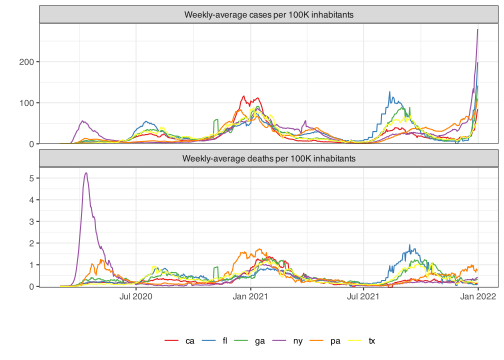

<!-- README.md is generated from README.Rmd. Please edit that file -->

# epidatasets

<!-- badges: start -->

[](https://github.com/cmu-delphi/epidatasets/actions/workflows/R-CMD-check.yaml)
<!-- badges: end -->

This package contains data sets used to compile vignettes and other
documentation in Delphi R Packages. The goal is to avoid calls to the
Delphi Epidata API, and deposit some examples here for easy offline use.

## Installation

You can install the development version of `{epidatasets}` like so:

``` r
# install.packages("pak")
pak::pkg_install("cmu-delphi/epidatasets")
```

## Contents

This package contains a number of different datasets, along with the
code used to generate them. See the Source Code if you want to examine
the necessary API calls.

All data included here is in `epi_df` format, which is a subclass of
`tbl_df` which is a subclass of `data.frame`. The data will print nicely
if you load the `{epiprocess}` or `{tibble}` packages, but these are not
required to access or inspect the data sets. For example,

``` r
library(epidatasets)
head(cases_deaths_subset)
```

    #>   geo_value time_value case_rate_7d_av death_rate_7d_av cases cases_7d_av
    #> 1        ca 2020-03-01       0.0032659        0.0000000     6    1.285714
    #> 2        ca 2020-03-02       0.0043545        0.0000000     4    1.714286
    #> 3        ca 2020-03-03       0.0061689        0.0000000     6    2.428571
    #> 4        ca 2020-03-04       0.0097976        0.0003629    11    3.857143
    #> 5        ca 2020-03-05       0.0134264        0.0003629    10    5.285714
    #> 6        ca 2020-03-06       0.0199582        0.0003629    18    7.857143

Compared to

``` r
library(tibble)
cases_deaths_subset
```

    #> # A tibble: 4,026 × 6
    #>    geo_value time_value case_rate_7d_av death_rate_7d_av cases cases_7d_av
    #>  * <chr>     <date>               <dbl>            <dbl> <dbl>       <dbl>
    #>  1 ca        2020-03-01         0.00327         0            6        1.29
    #>  2 ca        2020-03-02         0.00435         0            4        1.71
    #>  3 ca        2020-03-03         0.00617         0            6        2.43
    #>  4 ca        2020-03-04         0.00980         0.000363    11        3.86
    #>  5 ca        2020-03-05         0.0134          0.000363    10        5.29
    #>  6 ca        2020-03-06         0.0200          0.000363    18        7.86
    #>  7 ca        2020-03-07         0.0294          0.000363    26       11.6 
    #>  8 ca        2020-03-08         0.0341          0.000363    19       13.4 
    #>  9 ca        2020-03-09         0.0410          0.000726    23       16.1 
    #> 10 ca        2020-03-10         0.0468          0.000726    22       18.4 
    #> # ℹ 4,016 more rows

Compared to

``` r
library(epiprocess)
cases_deaths_subset
```

    #> An `epi_df` object, 4,026 x 6 with metadata:
    #> * geo_type  = state
    #> * time_type = day
    #> * as_of     = 2023-06-07 16:50:07.8681
    #> 
    #> # A tibble: 4,026 × 6
    #>    geo_value time_value case_rate_7d_av death_rate_7d_av cases cases_7d_av
    #>  * <chr>     <date>               <dbl>            <dbl> <dbl>       <dbl>
    #>  1 ca        2020-03-01         0.00327         0            6        1.29
    #>  2 ca        2020-03-02         0.00435         0            4        1.71
    #>  3 ca        2020-03-03         0.00617         0            6        2.43
    #>  4 ca        2020-03-04         0.00980         0.000363    11        3.86
    #>  5 ca        2020-03-05         0.0134          0.000363    10        5.29
    #>  6 ca        2020-03-06         0.0200          0.000363    18        7.86
    #>  7 ca        2020-03-07         0.0294          0.000363    26       11.6 
    #>  8 ca        2020-03-08         0.0341          0.000363    19       13.4 
    #>  9 ca        2020-03-09         0.0410          0.000726    23       16.1 
    #> 10 ca        2020-03-10         0.0468          0.000726    22       18.4 
    #> # ℹ 4,016 more rows

Note that an `epi_df` comes with metadata (visible in that final
version), that describes the observation frequency, `time_type`, the
unit of geographical measurement, `geo_type` and the data vintage,
`as_of`. For more on these, see the `{epiprocess}`.

For the more visually inclined, that particular data set contains
reported 7-day averaged cases and deaths per capita for a handful of US
states.


